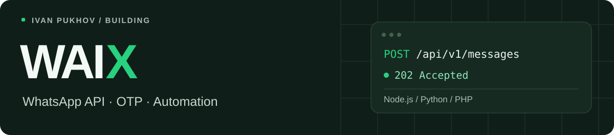

[Русский](https://github.com/ivanpukhov/ivanpukhov/blob/main/README.md) · **English**

### Ivan Pukhov

Full-stack developer based in Kazakhstan. I'm building **[WAIX](https://waix.kz)** to connect WhatsApp with websites, CRMs and applications: API messaging, OTP verification and campaigns with reply automation.

**[Website](https://waix.kz)** · **[API docs](https://waix.kz/docs)** · **[Integrations](https://waix.kz/integrations)** · **[MCP server](https://waix.kz/docs/mcp)**

### WAIX open source

| Repository | What's inside | Install |
| :--- | :--- | :--- |
| **[waix-node](https://github.com/ivanpukhov/waix-node)** | Node.js and TypeScript · ESM / CommonJS | [npm](https://www.npmjs.com/package/waix-node) |
| **[waix-python](https://github.com/ivanpukhov/waix-python)** | Python · zero external dependencies | [PyPI](https://pypi.org/project/waix-python/) |
| **[waix-php](https://github.com/ivanpukhov/waix-php)** | PHP · Composer | [Packagist](https://packagist.org/packages/waix/waix-php) |
| **[waix-integrations](https://github.com/ivanpukhov/waix-integrations)** | n8n, Make, Zapier, 1C, Bitrix24 and MCP | [Examples](https://waix.kz/integrations) |

The SDKs cover API v1: messages, templates, media, webhooks and OTP. Documentation is available in Russian and English.

**Stack:** Node.js · Python · React · PostgreSQL · Docker · GitHub Actions.
